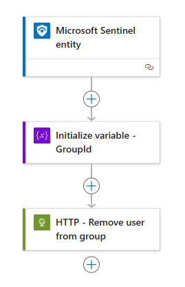

# Block-EntraIDUser

# Description
Just a simple playbook for blocking entra id account from signin-in.  
The playbooks utilize Conditional Access policy to block access to cloud resources. Target users for the conditional access policy is a entra ID group members. Playbooks will add member to the group.  
I have also included unblock playbooks.


Remember to update following params in main.bicep files:
- servicePrefix
- createdBy
- groupId

### Outline for block with incident trigger

  


### Outline for block with entity trigger


### Outline for unblock with incident trigger

  


### Outline for unblock with entity trigger



## Files
- Entity
    - main.bicep
- Incident
    - main.bicep
- unblock-Entity
    - main.bicep
- unblock-Incident
    - main.bicep

# Prequisites
- Azure Subscription with resource group for logic app
- User.ManageIdentities.All permission (or global admin)
- Powershell with [MicrosoftGraph Powershell SDK](https://learn.microsoft.com/en-us/powershell/microsoftgraph/installation?view=graph-powershell-1.0)
- Group & Conditional access policy

## Group & Conditional access policy
1. Create group
2. Create conditional access policy
    - Users
        - Include group you just created
        - Exclude MFA or any other emergency accounts
    - Target all resources
    - Grant BLOCK

# Deployment
1. In powershell navigate to entity or incident folder
2. Modify following az deployment command
3. Run the modified az deployment command in powershell

```powershell
 az deployment group create --name "Block-resources" --resource-group "YourRGHere" --template-file main.bicep
```

# Post-deployment - Assign permissions to managed identity

```powershell

# Add the correct 'Object (principal) ID' for the Managed Identity
$ObjectId = "OBJECTID"

# Add the correct Graph scope to grant
$graphScope = "GroupMember.ReadWrite.All"

Connect-MgGraph -Scope AppRoleAssignment.ReadWrite.All
$graph = Get-MgServicePrincipal -Filter "AppId eq '00000003-0000-0000-c000-000000000000'"

$graphAppRole = $graph.AppRoles | ? Value -eq $graphScope

$appRoleAssignment = @{
    "principalId" = $ObjectId
    "resourceId"  = $graph.Id
    "appRoleId"   = $graphAppRole.Id
}

New-MgServicePrincipalAppRoleAssignment -ServicePrincipalId $ObjectID -BodyParameter $appRoleAssignment | Format-List


```


# Changes
|Date|Description|
|--|--|
|2024-11-24|Created bicep templates & readme|
