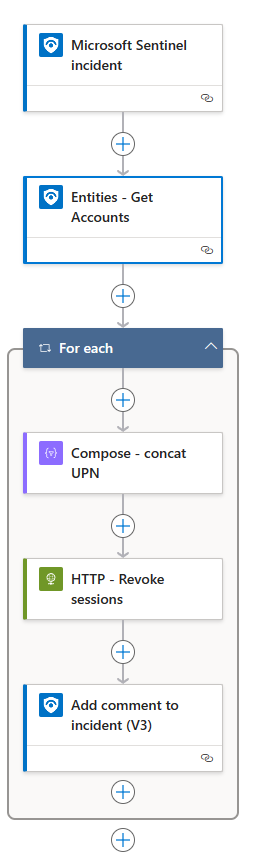

# Revoke-EntraIDUserSignInSessions

This is just a simple revoke user sign in sessions playbook for incident and entity triggers.

# Description

Both of the playbook templates creates following Azure resources:
- Logic App
- Managed identity for Logic App
- Microsoft Sentinel API connection for Managed Identity


## Incident Trigger
1. Trigger: When incident is triggered
2. Get account entities from incident
3. Loop through accounts
4. Compose UPN
5. Revoke user session
6. Add comment to sentinel incident



## Entity Trigger
1. Trigger: Microsoft Sentinel entity
2. Compose - concat UPN
3. HTTP - Revoke sessions
4. Add comment to incident (V3)


## ToDo
1. Create Graph powershell script to assign permissions for managed identity
2. Create a bicep template 

# Prequisites
1. Sentinel workspace
2. AzureAD Powershell module

# Post-deployment
1. Assign Sentinel Responder role to Managed identity created by Logic App.
2. Assign `User.ReadWrite.All` Graph API permission to managed Identity

## Powershell for grating permissions for Managed identity

```powershell
$MIGuid = "<Enter your managed identity guid here>"
$MI = Get-AzureADServicePrincipal -ObjectId $MIGuid

$GraphAppId = "00000003-0000-0000-c000-000000000000"
$PermissionName = "User.ReadWrite.All" 

$GraphServicePrincipal = Get-AzureADServicePrincipal -Filter "appId eq '$GraphAppId'"
$AppRole = $GraphServicePrincipal.AppRoles | Where-Object {$_.Value -eq $PermissionName -and $_.AllowedMemberTypes -contains "Application"}
New-AzureAdServiceAppRoleAssignment -ObjectId $MI.ObjectId -PrincipalId $MI.ObjectId `
-ResourceId $GraphServicePrincipal.ObjectId -Id $AppRole.Id
```

# Changes
|Date|Description|
|--|--|
|2023-12-21|Initial development|
|2024-01-13|Creating playbooks and readme|